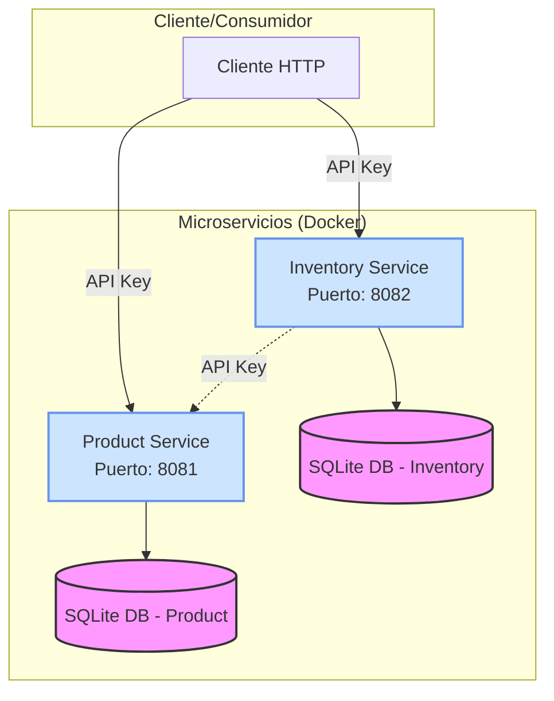
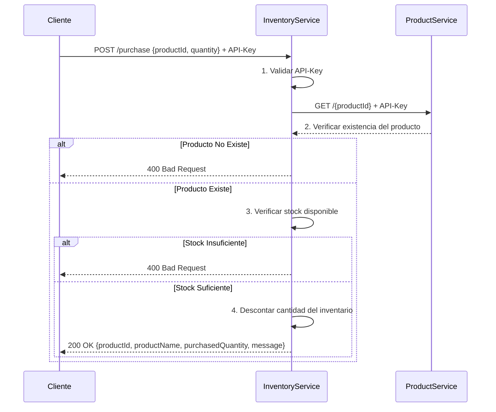

# 🛒 Sistema de Gestión de Productos e Inventario

[](https://www.oracle.com/java/technologies/javase/jdk17-archive-downloads.html)
[](https://spring.io/projects/spring-boot)
[](https://www.docker.com/)
[](https://jsonapi.org/)

## 📋 Descripción General

Este proyecto implementa una solución de microservicios para la gestión de productos e inventario, cumpliendo con los requisitos de la prueba técnica Backend. Está compuesto por dos microservicios independientes desarrollados en Java con Spring Boot, que interactúan mediante llamadas HTTP seguras. La solución demuestra buenas prácticas de desarrollo, incluye pruebas automatizadas y está lista para ser ejecutada con Docker.

## 🏗️ Arquitectura del Sistema

## 🧩 Componentes
Product Service (product-service): Gestiona la información de los productos (nombre, precio, descripción).
Inventory Service (inventory-service): Gestiona el inventario (cantidad disponible) y procesa las compras.
Comunicación Segura: Los servicios se comunican usando API Keys.
Persistencia: Cada servicio utiliza una base de datos SQLite independiente.
Contenedores: Ambos servicios están containerizados con Docker.

## 🔄 Diagrama de Flujo de Compra

## 🧠 Decisiones Técnicas y Justificaciones
### 💾 Elección de la Base de Datos: SQLite
Se seleccionó SQLite para el entorno local y de pruebas debido a:

Simplicidad: No requiere un servidor de base de datos externo, facilitando el desarrollo y despliegue.
Ligereza: Ideal para aplicaciones pequeñas o de prueba, reduciendo la complejidad del entorno.
Consistencia con los Requisitos: Se ajusta a las opciones permitidas en la prueba técnica.
Para un entorno de producción, se podría considerar una base de datos más robusta como PostgreSQL.

### 🔐 Autenticación entre Servicios: API Keys
Se implementó autenticación mediante API Keys para la comunicación entre microservicios y para la exposición de APIs públicas. Esta decisión se basa en:

Simplicidad: Fácil de implementar y entender.
Seguridad Básica: Protege los endpoints de accesos no autorizados.
Eficiencia: Bajo overhead en comparación con mecanismos más complejos como JWT o OAuth2, adecuado para una arquitectura de microservicios simple.
### 📍 Ubicación del Endpoint de Compra (POST /purchase)
El endpoint de compra se implementó en el inventory-service. Esta decisión se justifica por:

Coesión y Responsabilidad Única: El inventario es el responsable de gestionar la disponibilidad de productos. Comprar implica verificar y modificar el stock, lo cual es una función intrínseca del servicio de inventario.
Consistencia de Datos: Al estar el endpoint en inventory-service, se garantiza que la verificación de stock y la actualización del inventario ocurran de forma atómica dentro del mismo contexto de transacción, reduciendo la posibilidad de inconsistencias.
Acoplamiento Controlado: inventory-service consume datos de product-service (verificando la existencia del producto), lo que crea un acoplamiento controlado y unidireccional. Invertir esta dependencia (haciendo que product-service gestione el inventario) violaría el principio de responsabilidad única y crearía un acoplamiento más complejo.
### 📦 Comunicación entre Microservicios: WebClient (Spring WebFlux)
Se utilizó WebClient de Spring WebFlux para las llamadas HTTP entre microservicios debido a:

Reactividad: Permite llamadas no bloqueantes, mejorando el rendimiento potencial.
Integración con Spring: Es la opción recomendada por Spring para clientes HTTP reactivos.
Manejo de Errores: Facilita un manejo de errores más robusto y estructurado.
### 📜 Estándar de Respuesta: JSON:API
Se implementó el estándar JSON:API para todas las respuestas de los microservicios, asegurando:

Consistencia: Un formato uniforme para todas las respuestas.
Claridad: Estructura clara que separa datos (data), metadatos (meta) y enlaces (links).
Facilidad de Parseo: Facilita el consumo de las APIs por parte de clientes.
## ▶️ Instrucciones de Ejecución
### 🐳 Usando Docker Compose (Recomendado)
Clonar el repositorio
Construir y ejecutar los servicios
```bash
docker-compose up --build
```
Los servicios estarán disponibles en:
Product Service: http://localhost:8081/api
Inventory Service: http://localhost:8082/api
## 🧪 Pruebas
Se incluyen pruebas unitarias e integración para ambos microservicios.

Cobertura: Se espera una cobertura alta (>80%), verificable mediante herramientas como JaCoCo.
## Ejecución de Pruebas:
### Para ejecutar pruebas unitarias
```bash
./mvnw test
```
### Para ejecutar pruebas de integración y generar reporte de cobertura
```bash
./mvnw verify
```
## 🧰 Ejecución Local (sin Docker)
Requisitos Previos: Java 17, Maven.
Ejecutar product-service:
```bash
cd product-service
./mvnw spring-boot:run
```
Ejecutar inventory-service (en otra terminal):
```bash
cd inventory-service
./mvnw spring-boot:run
```
## 🤖 Uso de Herramientas de IA
Durante el desarrollo de esta solución, se utilizaron herramientas de IA para acelerar el proceso y mejorar la calidad del código:

Herramientas Utilizadas: GitHub, ChatGPT, QWen.
Tareas Realizadas:
Generación de estructuras de proyecto base con Spring Boot.
Creación de modelos de datos (entidades JPA).
Desarrollo de controladores REST y servicios.
Escritura de pruebas unitarias y de integración.
Refactorización de código para mejorar la legibilidad y mantenibilidad.
Generación de documentación inicial (READMEs, comentarios).
Verificación de Calidad: Todo el código generado por IA fue revisado manualmente para asegurar su corrección, seguridad y cumplimiento con las buenas prácticas. Las pruebas automatizadas validan el funcionamiento correcto del código generado.
## 📚 Documentación de Microservicios
Para información detallada sobre cada microservicio, consulte sus respectivos README:

Product Service README
Inventory Service README
## 📄 Licencia
Este proyecto está licenciado bajo la Licencia ""